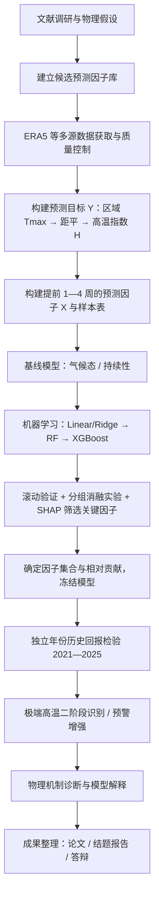

# 02 技术路线与总体流程

[← 返回总览](00_总览与目录.md)

---

## 一、总体技术路线图



> 该流程与 `plans.ipynb` 中的 10 步闭环完全一致，只是把"数据链路"和
> "样本表"拆成了两个独立步骤，便于分工与验收。

---

## 二、十二个执行步骤（对应原方案的 9 条技术路线）

| 序号 | 步骤 | 输入 | 输出 | 责任人 |
| --- | --- | --- | --- | --- |
| 1 | 1981—2025 年 5—8 月 ERA5 数据下载与质量控制 | CDS API 账号、变量清单 | 原始 NetCDF/GRIB 数据 + 数据清单 | 成员A |
| 2 | 计算长江中下游逐日最高气温 Tmax，并构建区域 Tmax 时间序列 | 逐小时 T2m | 逐日 Tmax 网格场、区域 Tmax 序列 | 成员A |
| 3 | 计算气候态、Tmax 距平及标准化高温指数 H，形成预测目标 Y | 区域 Tmax 序列 | H 时间序列表 | 成员A |
| 4 | 构建提前 1、2、3、4 周的大气—陆面预测因子 X | 预处理后的多变量数据 | 四套因子表 + 样本表 | 成员B |
| 5 | 建立 Linear Regression、Random Forest Regression、XGBoost Regression 模型 | 样本表 | 模型代码与训练产物 | 成员C |
| 6 | 按时间划分训练集、验证集和测试集，比较预测值与真实值 | 样本表 | 预测结果表 | 成员C |
| 7 | 采用 MAE、RMSE、相关系数 R 和 R² 评价连续预测技巧 | 预测结果 | 技巧评估表 | 成员D |
| 8 | 利用 90% 或 95% 分位阈值将连续预测结果转换为极端高温预警，计算 Recall、F1 等 | 预测结果 + 阈值 | 极端事件评价表 + 预警模块 | 成员D |
| 9 | 使用 SHAP 分析变量贡献 | 训练好的模型 | SHAP 图与贡献表 | 成员E |
| 10 | 通过合成分析、相关/回归和环流诊断验证物理机制 | SHAP 关键因子 | 机制诊断图与结论 | 成员E |
| 11 | 分组消融实验（A—E）量化各类变量的增量技巧 | 样本表 | 消融结果表 | 成员C |
| 12 | 冻结模型并在独立年份一次性检验 | 冻结配置 | 独立年份检验报告 | 成员C + 成员D |

> **步骤 11 可以并与步骤 5—7 同期开展**，但必须在**模型冻结之前**完成，
> 否则会变成"看着测试集挑变量"。

---

## 三、阶段划分、里程碑与验收标准

### P0｜立项与方案定稿（第 1 个月）

- **任务**：文献调研；形成物理假设；确定研究区范围、时段、变量清单与目标定义；
  完成 CDS 数据申请；搭建代码仓库与环境（`uv sync`）。
- **里程碑 M0**：方案定稿评审通过。
- **验收标准**：产出《因子—物理假设表》（见
  [`03_数据与变量方案.md`](03_数据与变量方案.md) 第五节）；
  变量清单中每一项都能说出"为什么它可能有用"。

### P1｜数据链路与目标变量 Y（第 2—3 个月）★最高优先级

- **任务**：数据下载与质量控制；Tmax 计算；区域平均；气候态与标准差计算；
  生成 H 序列。
- **里程碑 M1**：Y 链路打通——得到"日期 → 区域 Tmax → 距平 → H"完整时间序列。
- **验收标准**：
  1. 无缺测、无重复日期、时间轴连续且时区统一；
  2. H 的季节循环被有效去除（各日历日均值接近 0、方差接近 1）；
  3. 极端高温年份（如 2013、2017、2022 年夏季）在 H 序列上明显偏正；
  4. 出图并人工核查。

> 原方案明确指出：**"当前不应急于训练模型。第一优先级是完成目标变量 Y 的数据链路。"**
> 这条约束在进度管理中不可让步——Y 不可靠时，后续所有技巧评估都无意义。

### P2｜预测因子 X 与样本库（第 3—4 个月）

- **任务**：按日统计口径处理各变量；构建前期平均/累计/异常状态特征；
  生成提前 1/2/3/4 周四套样本表；实现防泄漏校验脚本。
- **里程碑 M2**：四套样本表交付并通过抽查。
- **验收标准**：随机抽 100 行，逐行核对"因子时间窗口的右端 ≤ 发布时刻"；
  通过率必须 100%。

### P3｜基线模型与机器学习建模（第 5—6 个月）

- **任务**：实现气候态与持续性基线；实现 Linear/Ridge、RF、XGBoost；
  完成时间块划分与滚动验证；在验证集上调参。
- **里程碑 M3**：基线—机器学习对照结果表完成。
- **验收标准**：能明确回答"RF/XGBoost 相对线性模型与基线提升了多少 RMSE / R²"。

### P4｜消融实验、因子确定与模型冻结（第 6—7 个月）

- **任务**：A—E 分组消融；SHAP 与 Permutation Importance 交叉印证；
  确定最终因子集合与超参数；**冻结模型**并登记配置哈希。
- **里程碑 M4**：模型冻结（Freeze）。
- **验收标准**：冻结配置写入 `configs/frozen_v1.yaml`，
  冻结后**不再修改**任何特征工程、因子集合与超参数。

### P5｜独立年份检验与极端事件评估（第 7—8 个月）

- **任务**：用冻结模型一次性预测 2021—2025 年；计算连续指标；
  构建极端阈值二阶段识别模块；计算分类与预警指标。
- **里程碑 M5**：独立检验报告 + 极端事件评价表。
- **验收标准**：测试集只被使用**一次**；结果无论好坏都如实记录；
  不得依据测试结果回头调整因子或超参数。

### P6｜机制验证与成果产出（第 9—12 个月）

- **任务**：合成分析、相关/回归、环流异常场诊断、显著性检验；
  论文撰写；结题报告；答辩材料与可复现打包。
- **里程碑 M6**：结题与答辩。
- **验收标准**：所有结论均可由仓库中的脚本 + 配置复现；
  图表与结论一一对应；机制结论明确区分"统计相关"与"物理因果"。

---

## 四、阶段依赖关系（关键路径）

```
P0 ──→ P1 ──→ P2 ──→ P3 ──→ P4 ──→ P5 ──→ P6
        ↑        ↑
        │        └── 依赖 P1 的 H 序列（Y 不定，样本表无法定）
        └── 依赖 P0 的变量清单与研究区定义
```

- **关键路径 = P1**：Y 链路延期会直接推迟所有后续阶段。
- **可以并行的事**：P0 期间可同步申请数据与搭建环境；
  P2 期间可并行编写模型骨架与评估函数（用合成数据测试）；
  P5 期间可并行启动论文方法与数据章节写作。

---

## 五、数据流与产物（谁产出、谁消费）

| 产物 | 产出者 | 消费者 | 存放位置（建议） |
| --- | --- | --- | --- |
| 原始 ERA5 数据 | 成员A | 成员A、B | `data/raw/`（不入 git） |
| 中间预处理数据 | 成员A、B | 成员B、C | `data/interim/`（不入 git） |
| 目标序列表 Y（含 H） | 成员A | 成员B、C、D、E | `data/processed/y_series.parquet` |
| 四套样本表（X, Y） | 成员B | 成员C、D、E | `data/processed/samples_lead{1..4}.parquet` |
| 数据字典 | 成员A + 成员B | 全体 | `docs/data_dictionary.md` |
| 模型与配置 | 成员C | 成员D、E | `configs/`、`models/` |
| 评价结果表 | 成员D | 成员E、全体 | `results/metrics/` |
| SHAP 与机制图 | 成员E | 全体 | `results/figures/` |

---

## 六、变更记录

| 日期 | 变更内容 | 提出人 | 影响文件 |
| --- | --- | --- | --- |
| （待填） | 规划书初版建立 | — | 全部 |

> 规则：任何影响**研究区、时段、目标定义、因子集合、数据集划分**的变更，
> 都必须在此登记，并同步更新对应文件；变更需在组会通过后方可执行。
