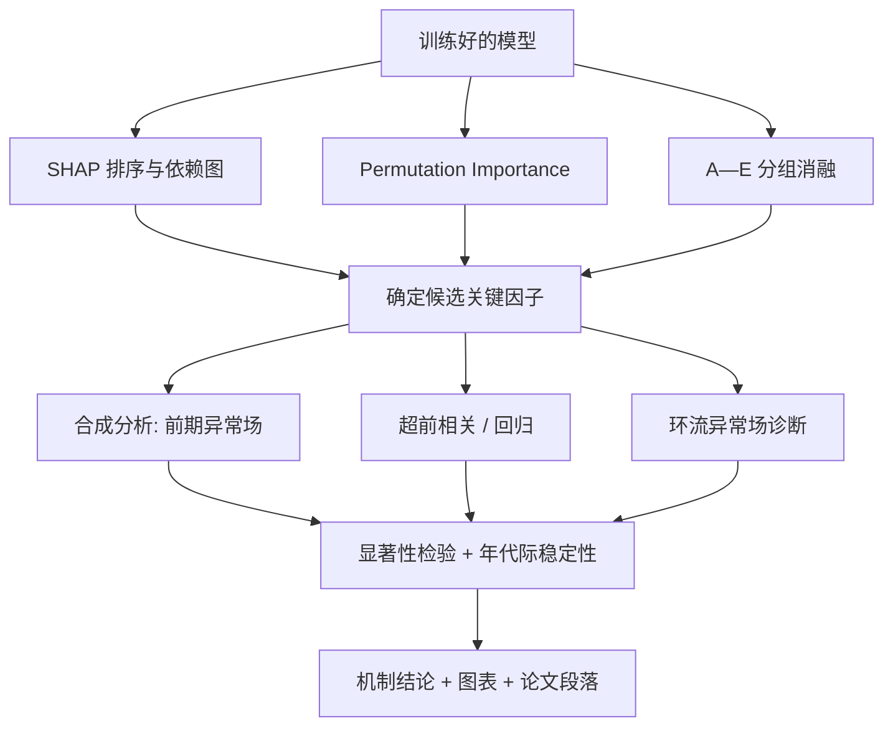

# 07 可解释性与物理机制验证

[← 返回总览](00_总览与目录.md) ｜ [← 上一板块：评价体系](06_评价体系与极端高温二阶段.md)

> 对应原方案第十节与 `plans.ipynb` 的"物理机制诊断与模型解释"环节。
> 核心立场：**SHAP 给线索，气候动力学给判据。统计相关不等于因果。**

---

## 一、三重证据体系：为什么不能只看 SHAP

原方案的关键提醒：

> "不要简单说'SHAP 最高的就是最重要的物理因子'。
> 多个高度相关的气象变量会互相分摊贡献，
> 因此最终判断'关键预测因子'要综合模型性能和物理机制。"

例如 SWVL1（土壤湿度）与 TP（降水）高度相关，两者会**分摊**同一份贡献；
如果只看 SHAP 排名，可能会误判"降水不重要"。

因此本项目采用**三重证据交叉印证**：

| 证据 | 回答的问题 | 优势 | 局限 |
| --- | --- | --- | --- |
| **① 分组消融实验** | 哪一类变量带来增量技巧？ | 直接度量预测价值；不受单变量分摊影响 | 组内无法区分具体变量 |
| **② SHAP** | 每个样本、每个变量贡献多少？方向如何？ | 有方向、可到样本级、可画依赖图 | 相关变量分摊贡献；不表示因果 |
| **③ Permutation Importance** | 打乱某变量后性能掉多少？ | 与模型结构无关，直接对应"预测价值" | 同样受相关性影响；计算量大 |
| **④ 物理机制诊断**（外部判据） | 这个关系有物理解释吗？是否稳定显著？ | 提供因果与机理层面的支撑 | 需要额外分析与领域知识 |

**判定规则**：

- 三种模型侧证据（①②③）**一致指向**的变量 → 列为"稳健关键因子"；
- 只有 SHAP 高但消融与置换都不显著 → 列为"可疑因子"，需机制诊断判断；
- 模型侧证据弱但物理假设强 → 作为**假设检验结果**讨论，不得当作已证实的结论。

---

## 二、SHAP：原理、用法与注意事项

### 2.1 原理

**SHAP**（SHapley Additive exPlanations）源自合作博弈论中的 **Shapley 值**：
把一个预测结果看作"多人合作获得的收益"，
按每个参与者（特征）对收益的**边际贡献**进行公平分配。

对一个样本，SHAP 把预测值分解为：

```
ŷ = 基准值（所有样本的平均预测） + Σ_j φ_j
```

其中 `φ_j` 是第 j 个特征的 SHAP 值。它满足几条好性质：
**局部准确性**（各贡献之和恰好等于该样本的预测与基准之差）、
**一致性**（模型对某特征的依赖增强时，其贡献不会下降）、**缺失即零**。

对树模型有专门的高效精确算法 **TreeSHAP**，本项目优先使用。

### 2.2 常用图与读法

| 图 | 横/纵轴 | 读法 |
| --- | --- | --- |
| **Summary Plot（蜂巢图）** | 纵轴=变量（按重要性排序），横轴=SHAP 值，颜色=特征值高低 | 看**方向**：特征值高（红）集中在 SHAP 正值区，说明该变量增大推高预测 |
| **Bar Plot** | 平均绝对 SHAP 值 | 只看重要性排序，不看方向 |
| **Dependence Plot** | 横轴=特征值，纵轴=SHAP 值 | 看**关系形状**（线性/饱和/非单调）与**交互**（颜色标另一变量） |
| **Waterfall / Force Plot** | 单样本分解 | 解释**具体某一年/某一次高温过程**为什么被预测为高温 |
| **分提前期对比** | 1/2/3/4 周的 SHAP 排序 | 看**主导因子是否随提前期转换** |

### 2.3 注意事项（写作时必须声明的局限）

1. **SHAP 不是因果**：它只描述"模型如何使用该变量"，不说明"改变该变量会改变天气"；
2. **相关变量分摊贡献**：物理上等价的两个因子可能各分到一半贡献，
   从而双双"看起来不重要"；
3. **依赖训练分布**：SHAP 在训练数据分布之外（如极端年份）的解释不可靠；
4. **符号依赖数据约定**：若潜热通量的符号约定搞错，SHAP 方向会完全反向
   （呼应 [`03_数据与变量方案.md`](03_数据与变量方案.md) 第五节第 4 条）；
5. **需要多模型验证**：至少在线性模型（系数符号）与树模型（SHAP）上分别看方向是否一致。

---

## 三、Permutation Importance（置换重要性）

**做法**：把验证集（或测试集）中某列特征的值**随机打乱**，
其他特征不变，重新预测并计算性能下降幅度。下降越多，说明模型越依赖该特征。

要点：

- **必须在验证集/测试集上做**，不能在训练集上做（训练集上打乱后模型仍可能靠记忆恢复）；
- 重复多次打乱取平均，给出标准差；
- 对相关特征组，应**整组一起打乱**（例如把 SWVL1 与 TP 同时打乱），
  否则模型可以从"被保留的相关变量"中恢复信息，导致重要性被低估；
- 与 SHAP 联合报告，二者不一致时在报告中讨论原因。

---

## 四、分组消融实验（详见 05）

消融实验的详细设计见 [`05_模型体系与实验设计.md`](05_模型体系与实验设计.md) 第四节。
在机制验证环节，它承担"**模型性能侧**证据"的角色：
A→B→C→D→E 每加一组变量，RMSE 降低多少、R 提升多少。

---

## 五、物理机制验证方法

### 5.1 方法工具箱

| 方法 | 做法 | 回答的问题 |
| --- | --- | --- |
| **合成分析（Composite Analysis）** | 按事件分组（如取 H > 90% 分位的所有日期为"极端组"，其余为"对照组"），分别求各要素的平均场，两组相减得到**异常场** | "高温发生前后，环流与陆面的典型形态是什么？" |
| **超前/滞后合成** | 以高温日为第 0 天，分别合成 −28、−21、−14、−7 天的异常场 | "高温发生前几周，哪个因子先出现异常？"——**这是延伸期前兆的直接证据** |
| **相关分析** | 计算前期因子与后期 H 的相关系数（含超前相关） | "关系有多强、方向如何？" |
| **回归分析** | 单变量/多变量线性回归，给系数与显著性 | "控制其他因子后，该因子是否仍有独立贡献？" |
| **环流异常场诊断** | 合成 Z500、850 hPa 风场异常，识别副高位置/强度、波列、阻塞等 | "环流形势是否符合已知的高温型？" |
| **显著性检验** | Student's t 检验、Mann–Whitney U 检验、分块 bootstrap | "这个异常是真信号还是抽样噪声？" |
| **稳定性检验** | 分年代（如 1981—2000 vs 2001—2025）重复分析 | "关系是否随时间稳定？" |

### 5.2 待检验的核心假设链条

**假设一：陆面干湿—蒸散—高温链条**

```
前期土壤偏干（SWVL1 低 / TP 少）
      ↓
蒸散受限（AVG_SLHTF 潜热减少）
      ↓
可用于冷却地表的能量减少，更多能量转为感热（感热通量增加）
      ↓
近地面升温、边界层干热化
      ↓
高温增强并自我维持（土壤湿度记忆）
```

**检验方式**：
1. SHAP 显示 SWVL1 低值对应正的高温贡献（方向符合）；
2. 合成分析：极端高温组的前期 SWVL1 显著偏低、AVG_SLHTF 显著偏少；
3. 滞后相关：前期 SWVL1 与后期 H 显著负相关，且相关在 1—3 周内保持；
4. 消融实验：加入 SWVL1/TP（B 组）后技巧有增量；
5. 回归控制环流因子后，SWVL1 的系数仍显著 → 说明不是纯环流的代理变量。

**假设二：环流—下沉增温链条**

```
Z500 正异常 / 西太副高偏强偏西
      ↓
中层高压脊控制、下沉气流
      ↓
绝热下沉增温 + 晴空辐射增强（SSRD 偏多）
      ↓
高温增强
```

**检验方式**：
1. 合成 Z500 异常场，检查是否呈副高型（正高度异常覆盖研究区）；
2. 850 hPa 风场异常是否为反气旋式；
3. SHAP 显示 Z500 正异常对应正贡献；
4. 消融 D 组（加入环流变量）技巧是否提升。

**假设三：海温—环流—高温链条（远周可能更重要）**

```
关键海区 SST 异常
      ↓
通过海气相互作用影响副高位置与强度、遥相关波列
      ↓
高温
```

**检验方式**：消融 E 组；SST 与 H 的超前相关；合成不同 SST 位相下的环流场。

### 5.3 结论表述规范

| 场景 | ✅ 可以说 | ❌ 不能说 |
| --- | --- | --- |
| SHAP 显示关系 | "模型在预测中显著依赖该因子的低值状态" | "土壤变干导致了高温" |
| 相关 + 合成 + 回归一致 | "结果支持'土壤偏干有利于后期高温'这一机制假设" | "已证实因果关系" |
| 关系不稳定 | "该关系在前后两个年代不一致，可能受年代际背景调制" | 直接删除不利结果 |
| 关系不符合预期 | "该因子在控制环流后无独立贡献，说明其作用可能被环流代理" | 回避不报 |

---

## 六、机制验证的执行顺序与产物



**交付物清单**：

- [ ] 各提前期（1—4 周）的 SHAP summary / bar / dependence 图
- [ ] 线性模型系数表（含符号与显著性）
- [ ] Permutation Importance 图（含多次打乱的标准差）
- [ ] A—E 消融结果表与柱状图
- [ ] 关键因子的超前—滞后合成分析图（−4 周至 0 周）
- [ ] Z500 与 850 hPa 风场的异常合成图
- [ ] 显著性检验与年代际稳定性检验结果
- [ ] 一份"关键因子清单 + 机制解释 + 证据强度分级"的汇总表

### 6.1 关键因子汇总表模板

| 因子 | 提前期 | 消融增量 | SHAP 排名 | 方向 | 机制假设 | 显著性与稳定性 | 结论强度 |
| --- | --- | --- | --- | --- | --- | --- | --- |
| SWVL1 | 2—3 周 | B 组 RMSE −x% | 前 3 | 低值→正贡献 | 陆面干湿—蒸散链条 | p < 0.05，两年代一致 | **强** |
| Z500 | 1—2 周 | D 组 RMSE −y% | 前 2 | 高值→正贡献 | 副高下沉增温 | p < 0.05 | **强** |
| SST | 3—4 周 | E 组提升不显著 | 中等 | 待定 | 海气相互作用 | 不显著 | 弱/待查 |

**结论强度分级**：强 = 三类模型证据一致 + 机制显著稳定；
中 = 部分证据支持；弱 = 仅单一证据或机制不显著。
**报告时必须给出分级，不得一律称为"关键因子"。**

---

## 七、相关术语

SHAP、Shapley 值、TreeSHAP、特征重要性、Permutation Importance、
依赖图、消融实验、合成分析、超前/滞后相关、
异常场、显著性检验、t 检验、Mann–Whitney U 检验、
bootstrap、年代际变化、西太副高、位势高度 Z500、
下沉增温、感热通量、潜热通量、蒸散、土壤湿度记忆、
陆气相互作用、统计相关与因果的区别。
详见 [`09_概念词典.md`](09_概念词典.md)。
