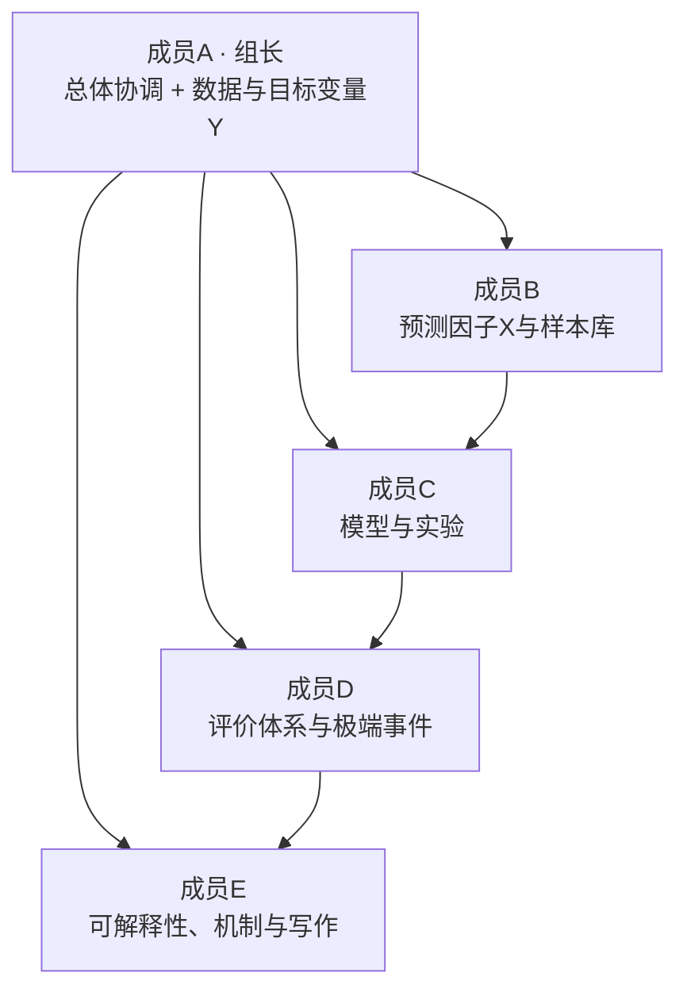

# 08 分工与进度安排

[← 返回总览](00_总览与目录.md) ｜ [← 上一板块：可解释性与机制](07_可解释性与物理机制验证.md)

> 团队规模：**5 人**。姓名一栏用「成员A—成员E」占位，确定人员后直接替换即可；
> **职责边界与交付物不随人名变化**。

---

## 一、团队结构与角色定位



五个角色对应项目的**五条数据/证据链**，每人都有独立、可验收的交付物，
同时通过"接口约定"（第三节）保证彼此的工作能拼接起来。

---

## 二、角色职责表

### 成员A｜组长 · 总体协调 + 数据与目标变量 Y

| 项目 | 内容 |
| --- | --- |
| **核心职责** | 项目统筹；ERA5 数据下载与质量控制；构建目标变量 Y 全链路 |
| **具体任务** | ① 文献调研组织与物理假设汇总；② CDS 数据申请与下载；③ 十项质量控制检查（时区、单位、累积量、符号、面积加权、层次、网格、范围、时间轴、留痕）；④ 计算逐日 Tmax、区域平均、气候态 Tclim 与 σ；⑤ 生成标准化高温指数 H 序列；⑥ 维护数据字典 |
| **交付物** | 原始数据 + 数据质量报告；`data/processed/y_series.parquet`；`docs/data_dictionary.md` |
| **关键卡点** | **P1 阶段（第 2—3 月）是全项目关键路径**，Y 不交付则全线阻塞 |
| **协调职责** | 周会主持；进度跟踪；与导师沟通；变更登记；风险预警 |

### 成员B｜预测因子 X 与样本库

| 项目 | 内容 |
| --- | --- |
| **核心职责** | 把多变量气象数据处理成机器学习可用的预测因子与样本表 |
| **具体任务** | ① 各变量日统计（T2m 日最高、TP 日累计、SWVL1 日平均等）；② 构建前期聚合特征（前 7/14/21/28 天平均、累计、异常）；③ 生成提前 1/2/3/4 周四套样本表；④ 实现 `check_leakage()` 防泄漏校验；⑤ 样本量与自相关诊断 |
| **交付物** | `data/processed/samples_lead{1..4}.parquet`；防泄漏校验脚本；特征说明文档 |
| **关键卡点** | 必须在 A 的 H 序列交付后才能定稿；但可提前用合成数据开发特征工程代码 |

### 成员C｜模型与实验

| 项目 | 内容 |
| --- | --- |
| **核心职责** | 从基线到机器学习的全部建模、调参与实验管理 |
| **具体任务** | ① 实现气候态、持续性基线；② 实现 Linear/Ridge、Random Forest、XGBoost；③ 时间块划分与滚动验证；④ 验证集超参数调优；⑤ A—E 分组消融实验；⑥ 确定最终因子集合并**冻结模型**；⑦ 用冻结模型一次性完成独立年份检验 |
| **交付物** | 模型代码；`configs/frozen_v1.yaml`；技巧评估表；消融结果表；实验日志 |
| **关键卡点** | 模型冻结（M4）是"测试集只能用一次"纪律的执行点，须由组长复核后生效 |

### 成员D｜评价体系与极端高温二阶段

| 项目 | 内容 |
| --- | --- |
| **核心职责** | 全部评价指标的定义、实现与解读；极端事件识别模块 |
| **具体任务** | ① 实现 MAE/RMSE/R/R²/技巧评分；② 实现分块 bootstrap 置信区间与显著性检验；③ 训练期分位阈值定义（90%/95%）；④ 极端阈值二阶段识别模块（阈值转换 + 分位数/加权回归两条路线）；⑤ 计算 Precision/Recall/F1/ROC-AUC/PR-AUC/HSS/TSS；⑥ 预警等级原型 |
| **交付物** | 评价函数库；连续指标表；极端事件评价表；预警原型脚本 |
| **关键卡点** | 评价函数应在 P2 阶段就用合成数据写好并自测，避免 P5 阶段成为瓶颈 |

### 成员E｜可解释性、机制诊断与成果写作

| 项目 | 内容 |
| --- | --- |
| **核心职责** | 回答"模型学到了什么、是否合理"，并负责成果表达 |
| **具体任务** | ① SHAP 分析（summary/bar/dependence，分提前期）；② Permutation Importance；③ 合成分析与超前/滞后合成；④ 相关/回归与环流异常场诊断；⑤ 显著性检验与年代际稳定性检验；⑥ 关键因子汇总表与证据强度分级；⑦ 论文、结题报告、答辩 PPT 与图件统稿 |
| **交付物** | SHAP 图件；机制诊断图；关键因子汇总表；论文初稿；答辩材料 |
| **关键卡点** | 依赖 C 的模型与 B 的样本表；但文献综述、方法章节、可视化模板可提前准备 |

---

## 三、任务分工矩阵（RACI）

**R** = 负责执行；**A** = 最终责任（批准）；**C** = 需被咨询；**I** = 需被通知。

| # | 任务 | 成员A | 成员B | 成员C | 成员D | 成员E |
| --- | --- | --- | --- | --- | --- | --- |
| 1 | 文献调研与物理假设 | **A/R** | C | I | I | C |
| 2 | 变量清单与研究区定稿 | **A/R** | C | C | I | I |
| 3 | ERA5 数据下载与质控 | **R** | C | I | I | I |
| 4 | Tmax / 区域平均 / H 序列 | **R** | C | I | C | I |
| 5 | 日统计与前期聚合特征 | C | **R** | I | I | I |
| 6 | 四套样本表与防泄漏校验 | A | **R** | C | I | I |
| 7 | 基线模型实现 | I | I | **R** | C | I |
| 8 | ML 模型与滚动验证 | I | I | **R** | C | I |
| 9 | 超参数调优 | I | I | **R** | I | I |
| 10 | 分组消融实验 A—E | I | C | **R** | C | C |
| 11 | 模型冻结 | **A** | I | **R** | C | I |
| 12 | 独立年份检验执行 | I | I | **R** | C | I |
| 13 | 连续指标评价 | I | I | C | **R** | I |
| 14 | 极端阈值与二阶段识别 | I | C | C | **R** | I |
| 15 | 预警等级原型 | I | I | C | **R** | C |
| 16 | SHAP 与置换重要性 | I | C | C | I | **R** |
| 17 | 机制诊断（合成/回归/环流） | C | C | I | C | **R** |
| 18 | 数据字典维护 | **R** | C | I | I | I |
| 19 | 实验日志与可复现性 | C | C | **R** | C | C |
| 20 | 论文与结题报告 | A | C | C | C | **R** |
| 21 | 答辩材料与演示 | **R** | C | C | C | C |
| 22 | 进度管理与风险跟踪 | **R/A** | I | I | I | I |

> **A/R 规范**：每项任务只有一个"最终责任（A）"，避免"人人负责等于无人负责"。
> 模型冻结（#11）的 A 是组长，确保"测试集只用一次"的纪律有人把关。

---

## 四、协作与接口约定（让五个人的工作能拼起来）

### 4.1 文件与目录约定

```
TCC/
├── notebooks/            # 探索性分析与规划书（本项目文档）
│   └── 项目规划书/        # 本规划书
├── src/tcc/              # 正式代码（唯一可信来源）
│   ├── data/             # 数据下载与预处理
│   ├── features/         # 特征工程与样本表
│   ├── models/           # 模型定义与训练
│   ├── evaluation/       # 指标与评价
│   ├── interpret/        # SHAP 与机制诊断
│   └── pipeline.py       # 一键运行入口
├── configs/              # 全部实验配置（yaml）
├── data/                 # 数据（不入 git）
├── results/              # 结果、图表、实验日志
└── docs/                 # 数据字典、方法说明
```

> **规则**：`notebooks/` 只用于探索，**任何进入结果的代码都必须沉淀到 `src/tcc/`**。

### 4.2 命名规范

| 对象 | 规范 | 示例 |
| --- | --- | --- |
| 实验运行目录 | `{阶段}_{模型}_{提前期}_{变量组}_{版本}` | `P4_xgb_lead2_groupD_v1` |
| 配置 | `configs/{用途}_{版本}.yaml` | `configs/frozen_v1.yaml` |
| 图表 | `fig{序号}_{内容}_{提前期}.png` | `fig03_shap_lead2.png` |
| 样本表 | `samples_lead{k}.parquet` | `samples_lead3.parquet` |

### 4.3 数据接口（样本表契约）

- 列名、单位、含义以 `docs/data_dictionary.md` 为**唯一权威**；
- 任何列名变更必须由成员A登记并**通知全体**，禁止单方面改名；
- 样本表一旦交付，前向兼容：**只增列，不改列含义**。

### 4.4 版本管理与代码评审

| 规则 | 说明 |
| --- | --- |
| 分支模型 | `main` 保护；功能分支 `feat/xxx`；修复 `fix/xxx`；合并需至少 1 人评审 |
| 提交信息 | `[模块] 简述`，例如 `[features] 加入前7天累计降水特征` |
| 不做的事 | 不提交 `data/`、`models/` 大文件、密钥文件；不直接 push 到 `main` |
| 代码评审 | 涉及样本表生成、指标计算、数据划分的代码，必须由非作者评审 |
| 环境 | 统一用 `uv sync`；新增依赖必须更新 `pyproject.toml` 与 `uv.lock` |

### 4.5 会议与沟通机制

| 机制 | 频率 | 参与人 | 内容 |
| --- | --- | --- | --- |
| 组会 | 每周 1 次（60—90 min） | 全体 + 导师（每 2—4 周一次） | 进度对齐、卡点、下周计划 |
| 阶段评审 | 每个里程碑（M0—M6） | 全体 + 导师 | 对照验收标准打分，决定是否进入下一阶段 |
| 结对评审 | 按需 | 相关 2 人 | 数据表/代码/图表交叉检查 |
| 异步沟通 | 随时 | 全体 | 群内同步；重要结论必须回写文档，不能只留在聊天记录 |
| 文档留痕 | 每周 | 各自 | 本周产出与问题写入共享进度表 |

### 4.6 冗余与交接（防止"人走事停"）

- 每项关键任务指定**一名备份人**：A↔B 互为数据链备份；C↔D 互为建模/评价备份；E 的绘图脚本由 C 备份；
- 所有脚本必须能**从头重跑**（不依赖个人电脑上的临时文件）；
- 每阶段结束时，负责人在组会上做 10 分钟交接说明。

---

## 五、12 个月进度安排

| 月份 | 阶段 | 主要任务 | 主责 | 交付物 / 里程碑 |
| --- | --- | --- | --- | --- |
| **第 1 月** | P0 立项 | 文献调研、物理假设、研究区与变量定稿、数据申请、环境搭建 | A（全员参与） | 因子—物理假设表；**M0 方案定稿** |
| **第 2 月** | P1 数据链路 | 数据下载、质控、逐日 Tmax 与区域平均 | A | 数据质量报告 |
| **第 3 月** | P1 收尾 + P2 启动 | 气候态/σ、H 序列；同步启动日统计与特征工程代码 | A、B | **M1 目标变量 Y 打通**；`y_series.parquet` |
| **第 4 月** | P2 样本库 | 前期聚合特征、四套样本表、防泄漏校验 | B | **M2 样本表交付**；`samples_lead1-4.parquet` |
| **第 5 月** | P3 建模 | 基线模型 + Linear/Ridge + RF + XGBoost 骨架；时间块划分 | C（D 并行写评价函数） | 首版技巧评估表 |
| **第 6 月** | P3→P4 | 滚动验证、超参数调优、分组消融 A—E | C、D | **M3 基线—ML 对照表**；消融结果表 |
| **第 7 月** | P4 冻结 | SHAP 初筛、因子集合确定、**模型冻结** | C、E | **M4 模型冻结**；`configs/frozen_v1.yaml` |
| **第 8 月** | P5 独立检验 | 一次性预测 2021—2025；连续指标与置信区间 | C、D | 独立检验报告 |
| **第 9 月** | P5 极端事件 | 阈值定义、二阶段识别模块、预警等级原型 | D | **M5 极端事件评价表**；预警原型 |
| **第 10 月** | P6 机制 | SHAP 全套图、合成分析、环流诊断、显著性检验 | E | 关键因子汇总表；机制图件 |
| **第 11 月** | P6 成果 | 论文初稿、结题报告、数据与代码打包 | E（全员供稿） | 论文初稿；结题报告 |
| **第 12 月** | P6 收尾 | 答辩材料、可复现性验证、结题答辩 | A（全员） | **M6 结题答辩** |

### 5.1 甘特示意

```
         1  2  3  4  5  6  7  8  9 10 11 12 (月)
P0 立项   ██
P1 数据      ██████
P2 样本            ██████
P3 建模                  ██████
P4 冻结                        ████
P5 检验                           ██████
P6 机制/写作                           ████████████
         ▲        ▲        ▲        ▲        ▲
        M0       M1/M2    M3/M4     M5       M6
```

### 5.2 关键路径与缓冲

- **关键路径**：P1（Y 链路）→ P2（样本表）→ P3（建模）→ P4（冻结）→ P5（检验）。
- **缓冲设置**：P1 预留半个月缓冲；P5 后预留半个月应对"结果需复核"的情况。
- **不可压缩的纪律时间**：模型冻结后到正式检验之间，必须留出至少 3 天做代码与配置复核。
- **并行机会**：P0 期即可申请数据与搭环境；P2 期 C/D 可并行开发模型骨架与评价函数
  （用随机合成数据自测）；P5 期 E 可并行撰写论文的数据与方法章节。

---

## 六、阶段性自检（每组会前由主责人填写）

| 检查项 | 是 / 否 | 备注 |
| --- | --- | --- |
| 本周交付物是否按约定格式产出？ | | |
| 是否阻塞了他人的下游任务？ | | |
| 是否有未登记的方案变更？ | | |
| 是否有"只在本地、未提交"的代码或数据？ | | |
| 下阶段验收标准是否明确（可量化）？ | | |
| 是否触碰了数据泄漏铁律 L1—L5？ | | |

---

## 七、相关术语

RACI、里程碑、关键路径、交付物、验收标准、
缓冲、结对评审、代码评审、
干湿链与环流链的分工对应关系。
详见 [`09_概念词典.md`](09_概念词典.md) 第 I 节"项目管理与工程"。
